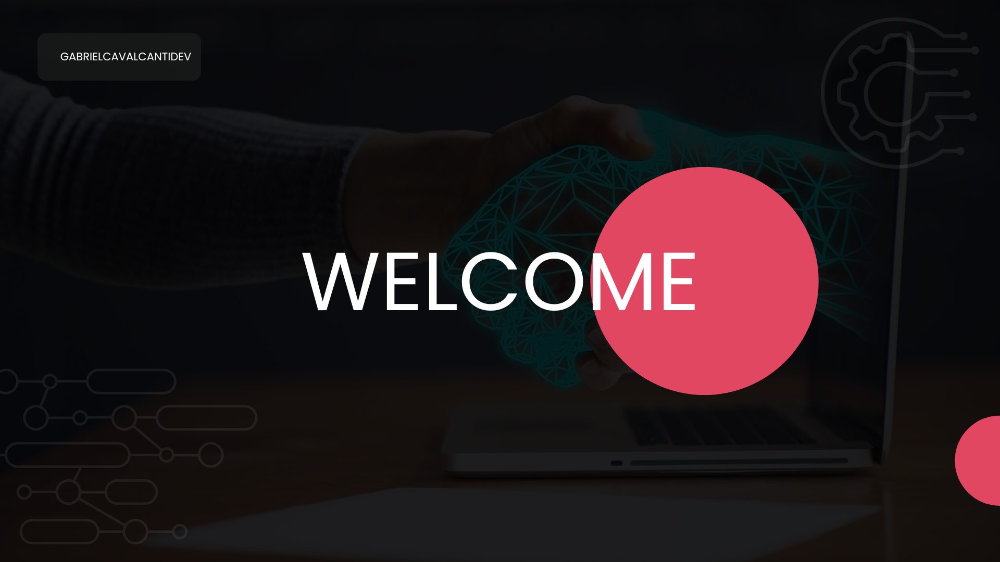

# Olá, sou Gabriel!

Bem-vindo ao meu perfil no GitHub. Sou um desenvolvedor apaixonado por QA, com experiência em Java, Python e Robot Framework. Aqui você encontrará meus projetos pessoais, seja de estudo ou apenas por diversão. Sinta-se à vontade para explorar e colaborar!

🔧 Tecnologias que uso:
- Linguagens: Java, Python
- Frameworks: Robot Framework

  

🌱 Atualmente aprendendo
- C#
- Typescript
- React

Se precisar entrar em contato, você pode me encontrar no Linkedin ao lado.

Obrigado pela visita!

<!---
GabrielCavalcantiDev/GabrielCavalcantiDev is a ✨ special ✨ repository because its `README.md` (this file) appears on your GitHub profile.
You can click the Preview link to take a look at your changes.
--->
